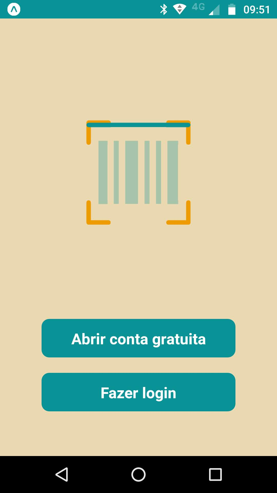
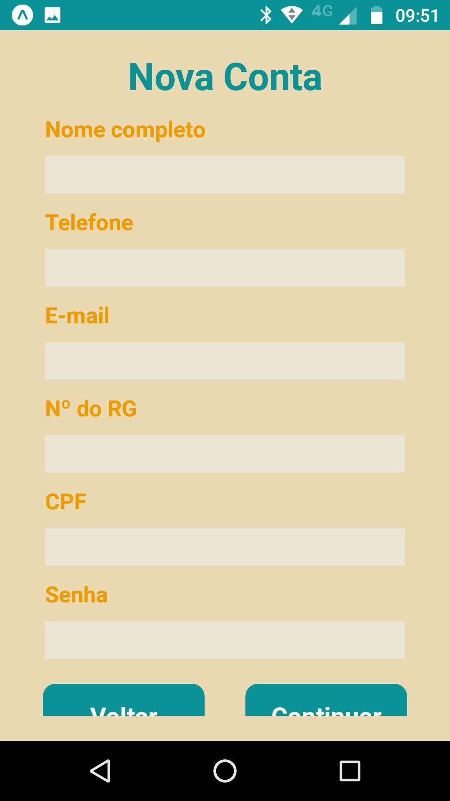
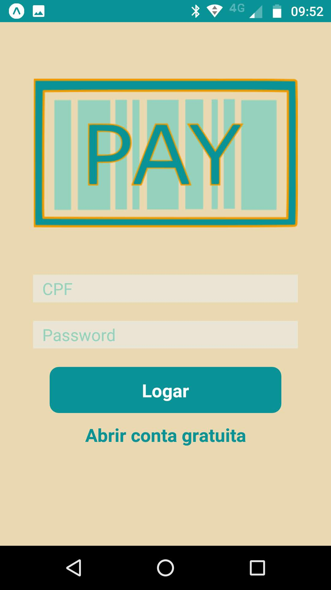
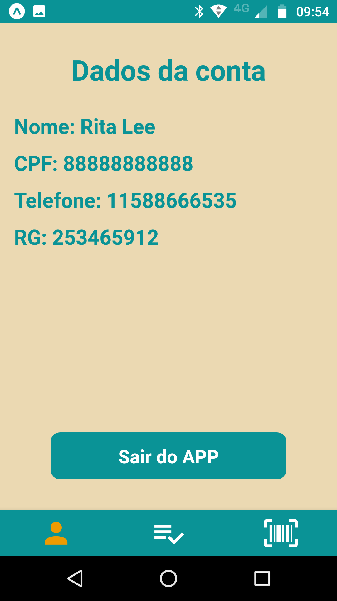
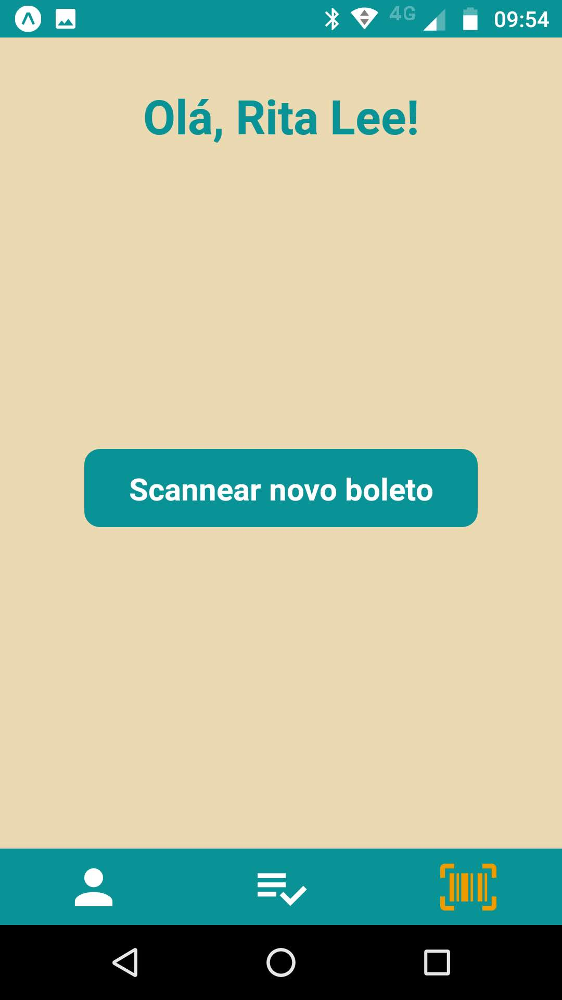
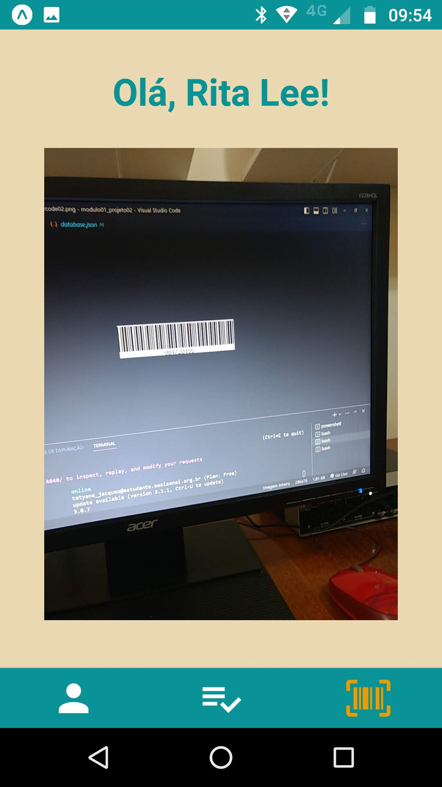
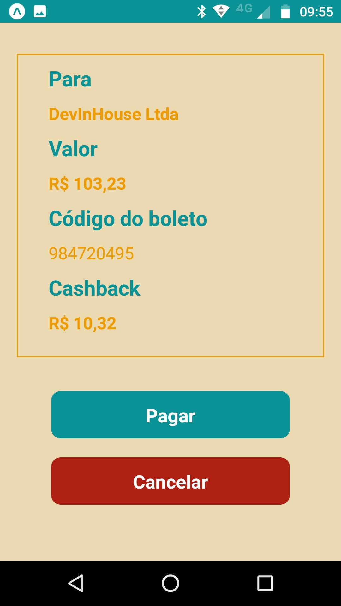
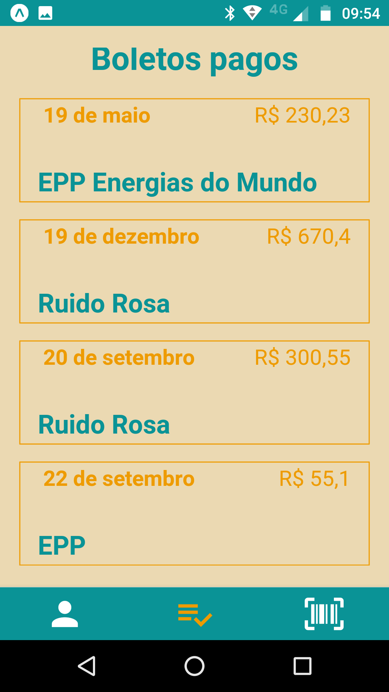

<h2>Pay Project - React Native</h2>

 

<ul>
<li>React Native</li>
</ul>

 

 Project developed during Senai's DEVinHouse course (2022/2023).

This project consists of an payments app. It is possible to register a user, log in with that user, pay bills and list paid bills.

 

    

 

App home screen. You can register a new user or log in with an existing user. The barcode image is LottieView library animation.

 

    

 

Registration screen. There is a second screen for registering the user's address in the same model. The address registering screen queries the API viacep and fills in the user's address based on postal code.

 

    

 

Login screen.

 

    

 

After login screen. Shows user data.

 

    

 

Screen with scanner button.

 

    

 

Scanner screen.

 

    

 

Payment confirmation screen. You can confirm or cancel.

 

    

 

Payment list screen. 

